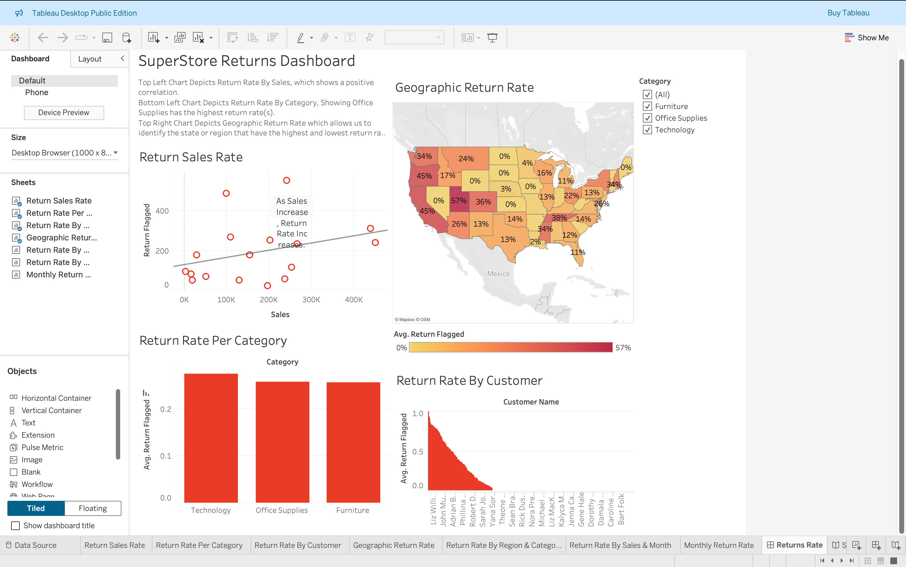

# Superstore Return-Rate Analysis

## Project Goal
The goal of this project was to analyze customer return patterns at the Superstore to identify the root causes of returned orders. The CEO requested a clear understanding of why returns are occurring at such a high rate and what strategic actions can be taken to reduce them. The analysis aimed to quantify the financial and operational impact of returns and to provide data-driven insights that support process improvements.

## Tools Used
Tableau (for data visualization and dashboard design)
Excel / Google Sheets (for data preparation and validation)
SQL (for data joins and calculated fields)
Pivot Tables and Filters (for exploratory analysis)

## Approach & Methodology
    Data Preparation
Performed a LEFT JOIN of the Returns table with the Orders table.
Created a calculated field for returns, assigning “Yes = 1” and “Null = 0” to measure return rate (average) and total returns (sum).
    Exploratory Analysis
Scatterplot: Assessed correlation between sales and returns aggregated by product subcategory.
Bar Chart: Calculated return rate by product category to identify categories with disproportionate return behavior.
Customer Analysis: Evaluated return rate by customer, filtering out one-time buyers to detect patterns among repeat customers.
Geographic Map: Analyzed return rate by state and city to detect regional concentrations.
Time-Series: Tracked return rate by month to identify seasonal effects.
Composite Charts: Combined multiple dimensions (date, geography, product category) to uncover layered insights into return patterns.
    Dashboard Development
Designed an interactive Tableau dashboard with KPIs, filters, and visualizations to allow the CEO and leadership team to monitor and investigate return trends.

## Key Findings From the Data
1.High-Return Product Categories: Office Supplies and Furniture showed the highest return rates relative to their sales volume, suggesting product quality or fulfillment issues.
2.Sales vs. Returns Correlation: Subcategories with high sales (e.g., Chairs, Binders) also showed disproportionately high returns, indicating that volume alone does not explain return frequency.
3.Customer Trends: A subset of repeat customers demonstrated higher-than-average return rates, signaling potential dissatisfaction or misuse of return policies.
4.Geographic Patterns: Certain urban regions recorded significantly higher return rates, hinting at localized delivery or fulfillment challenges.
5.Seasonality: Return rates spiked during Q4, aligning with holiday sales surges and suggesting that increased order volumes may strain quality control and logistics.

## Recommendations
Product & Vendor Review: Investigate high-return categories such as Office Supplies and Furniture to determine whether issues stem from quality, descriptions, or fulfillment errors.
Customer Policy Adjustments: Review return behavior of repeat customers with unusually high return rates; consider targeted communication or revised return policies.
Operational Improvements: Focus on fulfillment processes in regions with elevated return rates to address potential logistical challenges.
Seasonal Preparedness: Strengthen quality control and staffing during peak seasons to reduce errors leading to returns.
Dashboard Deployment: Implement the Tableau dashboard for ongoing monitoring, enabling leadership to identify issues in real-time and adjust strategies dynamically.

